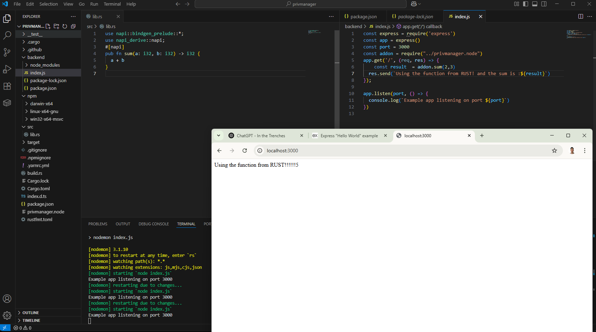

A Node.js native addon built with [napi-rs] using Rust.

To allow Node.js to call a DLL, you can integrate directly using napi-rs. Using napi-rs provides a more idiomatic and safer way to expose Rust functions directly to Node.js by compiling them into a .node native module, which can be required just like any regular JavaScript module. This method avoids dealing with raw DLLs and offers better type safety, making it ideal for Rust-to-Node.js integration.
